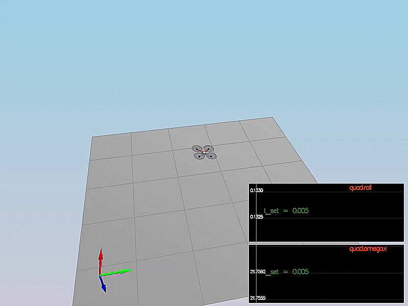

# Scenario 1: Adjust Mass
Through simple manual binary searching, the mass should be around `0.5` for the quad to stay in simulator.

# Scenario 2: Attitude Control
Result:

Firstly, implement `GenerateMotorCommands()` by solving the following equations: 
 

One thing to notice is that the order of motors are not numbered in the classic clockwise way.

`BodyRateControl()` and `RollPitchControl()` are almost the same with what we have learnt in the exercises of Lesson 14: Full 3D control.
Since body rate controller is a low level critical controller others depend on, we set `kpPQR` to larger value `65, 65, 20`. Based on this setting, the `kpBank` for roll-pitch controller is tuned to `10` for quick settling and small overshoot.
